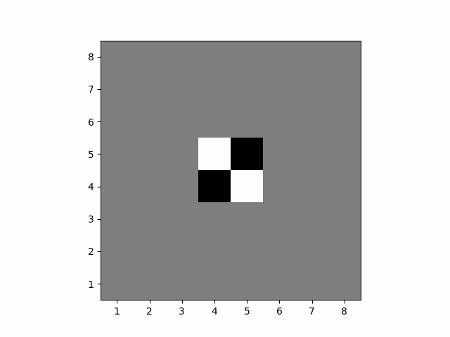

# Deep Learning for Othello Game

## Overview

This package is used for playing Othello game between two models. The game would be run two times with different colors for each player (different starting player) and it generates a GIF file as the log of each game.



## Installation

This package contains files as follows:

game.py : This code is used for playing Othello game between two models. The game would be run two times with different colors for each player (different starting player) and it generates a GIF file as the log of each game.

training_[x].py : this code is provided as an example of dataset loader and training a model.
 
networks_[your_student_number].py : This file contains your networks. You can define and compare several models with different class name in this file. You should change the name of this files to your student number, which is unique.

utils.py : this file contains functions that will be used as the rule and different steps of games.

## Usage

To use this package, follow these steps:

1. Install the required dependencies by running the following command:
```
pip install -r requirements.txt
```
Alternatively, you can install the individual packages using the following command:
```
pip install scikit-learn pandas tabulate matplotlib h5py scipy tqdm torch torchvision
```

2. Run the `game.py` file to play the Othello game between two models. The game will be run twice with different colors for each player, and it will generate a GIF file as the log of each game.

3. Use the `training_[x].py` file as an example of dataset loader and training a model.

4. Modify the `networks_[your_student_number].py` file to define and compare several models with different class names. Make sure to change the name of this file to your student number, which should be unique.

5. The `utils.py` file contains functions that will be used as the rule and different steps of the game.